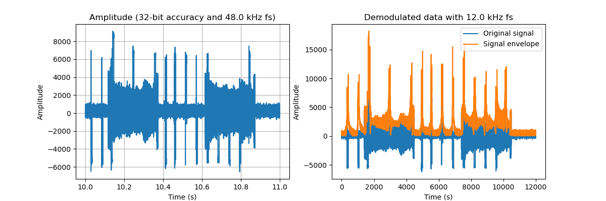
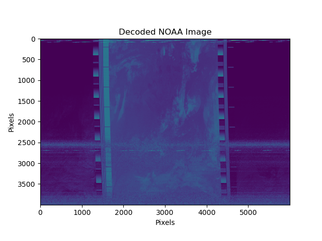

# NOAA decoder
NOAA15/18/19 weather satellite decoder Python script

Open source project to train your Python and signal processing skills.

Project repository: https://github.com/mimimaki/NOAA_decoder

## Background 
This project was done in one night just for fun. I previously had received some satellite images from NOAA18 using an SDR and wondered how hard would it be to decode it myself. The received signal is included as media/example.wav and I began by decoding it using the noaa-apt open source software (https://noaa-apt.mbernardi.com.ar/). The result is included as media/example_decoded.png and looks good. After this, I began exploring how to decode this myself.

## The Python script
The script begins by simply plotting a short illustration of the signal data in time domain. After this the signal is demodulated using Hilbert transform and then decoded into an image. The demodulation is done with Hilbert transform, whch returns the signal envelope. This envelope defines the pixel brightness values. After demodulation, the pixel values are mapped into an image.

## Result
The decoded image is not as smooth as the noaa-apt decoded one and is a bit shifted. Noaa-apt is able to fix the alignment. The application also enables you to use false color and to draw borders of countries. These functions would be much harder to implement and would be besides the original point of signal processing. However, this exercise serves well as an introduction to practical signal processing.

## Author
Written by Miikka Mäki (git: mimimaki), 5th August 2024.
### [Miikka Mäki](https://github.com/mimimaki)

## License
MIT License, free to use as you wish. 
